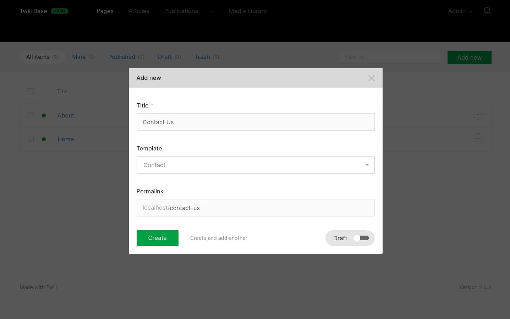

# Twill Form Templates

<a href="https://github.com/pboivin/twill-form-templates/actions"></a>
<a href="https://packagist.org/packages/pboivin/twill-form-templates"></a>
<a href="https://packagist.org/packages/pboivin/twill-form-templates"></a>

This package is a simple solution to add a `template` field to your Twill Modules and do interesting things with it. It can help you make small variations to your forms based on the selected template, organize your form variations with Blade partials, and prefill the block editor with a selection of blocks when a record is created.



<br>

**Table of contents**

- [Installation](#installation)
- [Getting Started](#getting-started)
- [Dedicated Form Templates](#dedicated-form-templates)
- [Using JSON Field Groups](#using-json-field-groups)
- [Block Editor Templates](#block-editor-templates)
- [Custom Template Field](#custom-template-field)
- [Working With Translations](#working-with-translations)
- [Extending the Package Views](#extending-the-package-views)
- [License](#license)

## Installation

```sh
composer require pboivin/twill-form-templates
```

## Getting Started

The following example will guide you through the steps to create a `pages` module and implement a `template` field.

### Create a New Module

```sh
php artisan twill:make:module pages --hasBlocks
```

For this example, make sure to enable the Blocks feature. Anything else is optional.

As usual, add the module to your `routes/admin.php` and `config/twill-navigation.php`.

### Update the Migration

Add the new `template` field:

```php
// update file: database/migrations/xxxx_xx_xx_xxxxxx_create_pages_tables.php


class CreatePagesTables extends Migration
{
    public function up()
    {
        Schema::create('pages', function (Blueprint $table) {
            // ...

            $table->string('template', 50)->nullable();
        });

        // ...
    }
}
```

Then run the migrations:

```sh
php artisan migrate
```

### Update the Model

Add the `HasFormTemplates` trait and the new field to `$fillable`:

```php
// update file: app/Models/Page.php


use Pboivin\TwillFormTemplates\HasFormTemplates;

class Page extends Model
{
    use HasFormTemplates;

    protected $fillable = [
        // ...
        
        'template',
    ];
    
    // ...
}
```

In the same file, define the values needed for your template field:

```php
    public $formTemplates = [
        'options' => [
            [
                'value' => 'home',
                'label' => 'Home',
            ],
            [
                'value' => 'about',
                'label' => 'About',
            ],
            [
                'value' => 'contact',
                'label' => 'Contact',
            ],
            [
                'value' => 'custom_page',
                'label' => 'Custom Page',
            ],
        ],
        'default' => 'custom_page'
    ];
```

Here, we define 3 templates for the core pages of our site (`home`, `about`, `contact`) and 1 that can be used more freely to create customized pages with the block editor (`custom_page`).

### Update the Repository

Add the `HandleFormTemplates` trait:

```php
// update file: app/Repositories/PageRepository.php


use Pboivin\TwillFormTemplates\HandleFormTemplates;

class PageRepository extends ModuleRepository
{
    use HandleFormTemplates;
    
    // ...
}
```

### Extend the Create View

To enable users to select a template when creating a new page, we need to extend Twill's built-in `create.blade.php` view. Here is [the original file](https://github.com/area17/twill/blob/2.x/views/partials/create.blade.php) for reference. Here is our extended version:

```blade
// add file: resources/views/admin/pages/create.blade.php


@formField('input', [
    'name' => $titleFormKey ?? 'title',
    'label' => $titleFormKey === 'title' ? 
        twillTrans('twill::lang.modal.title-field') : ucfirst($titleFormKey),
    'translated' => $translateTitle ?? false,
    'required' => true,
    'onChange' => 'formatPermalink'
])

@twillFormTemplateField()

@if ($permalink ?? true)
    @formField('input', [
        'name' => 'slug',
        'label' => twillTrans('twill::lang.modal.permalink-field'),
        'translated' => true,
        'ref' => 'permalink',
        'prefix' => $permalinkPrefix ?? ''
    ])
@endif
```

This uses a new `@twillFormTemplateField` directive to render the template field.

If you don't need to customize this further, you can use the shortcut provided by this package, instead of the above view:

```blade
// update file: resources/views/admin/pages/create.blade.php


@include('twill-form-templates::create')
```

### Update the Form View

The fun starts here :)

We can customize our form fields according to the selected template:

```blade
// update file: resources/views/admin/pages/form.blade.php


@extends('twill::layouts.form')

@section('contentFields')
    @formField('input', [
        'name' => 'description',
        'label' => 'Description',
        'translated' => true,
        'maxlength' => 100
    ])

    @if ($item->template === 'custom_page')
        @formField('block_editor')
    @endif
@stop
```

Here, all pages would contain a common `description` field, and the `custom_page` template would allow the full use of the block editor. This is obviously a simplified example but it should give you an insight on how to add variations to your forms based on a selection of templates.

## Dedicated Form Templates

The method presented above helps you introduce minor variations in your forms for each template. If you find that your form is starting to contain too many conditionals and you are trying to handle too many variations, consider using a dedicated partial for each template.

### Update the Form View

```blade
// update file: resources/views/admin/pages/form.blade.php


@extends('twill::layouts.form')

@twillFormTemplate()
```

This uses a new `@twillFormTemplate` directive to select the appropriate partial.

Then, all that's left is to create the partials:

- `resources/views/admin/pages/_home.blade.php`
- `resources/views/admin/pages/_about.blade.php`
- `resources/views/admin/pages/_contact.blade.php`
- `resources/views/admin/pages/_custom_page.blade.php`

The file names should follow this format: `_{$template}.blade.php`

If you don't want to create one partial for every template, you can add a default partial that will be used as a fallback:

- `resources/views/admin/pages/_default.blade.php`

## Using JSON Field Groups

With this approach, your `pages` database table need to contain all possible columns for the `pages` module. Again, this works well for a small number of variations but can start to feel ugly when all your pages have a different set of fields.

For this, you can use a built-in Twill feature to group all your form fields into a single JSON column in your table.

### Update the Migration

Along with the `template` field, define a `content` field:

```php
// update file: database/migrations/xxxx_xx_xx_xxxxxx_create_pages_tables.php


    Schema::create('pages', function (Blueprint $table) {
        // ...

        $table->string('template', 50)->nullable();

        $table->json('content')->nullable();
    });
    
    // ...
```

### Update the Model

Add the new field to `$fillable`:

```php
// update file: app/Models/Page.php


    use HasFormTemplates;

    protected $fillable = [
        // ...
        
        'template',
        'content',
    ];
```

### Update the Repository

Define all your form fields in `$fieldsGroups`:

```php
// update file: app/Repositories/PageRepository.php


    use HandleFormTemplates;

    protected $fieldsGroups = [
        'content' => [
            'page_title',
            'page_subtitle',
            'home_call_to_action',
            'about_footer_text',
            
            // ...
        ]
    ];
```

To keep things organized, you can prefix common fields with `page_`, and page-specific fields with the template name.

### Form View

You can use JSON fields like regular fields in your forms:

```blade
// update file: resources/views/admin/pages/form.blade.php


    @formField('input', [
        'name' => 'page_title',
        'label' => 'Page Title',
    ])

    @formField('input', [
        'name' => 'page_subtitle',
        'label' => 'Page Subtitle',
    ])

    @if ($item->template === 'home')
        @formField('input', [
            'name' => 'home_call_to_action',
            'label' => 'Call to Action',
        ])
    @endif

    @if ($item->template === 'about')
        @formField('input', [
            'name' => 'about_footer_text',
            'label' => 'Footer Text',
        ])
    @endif
    
    // ...
```

## Block Editor Templates

Form templates are a great fit for pages that share a lot of common fields. However, some pages are better served exclusively by the block editor to allow full customization. To help with this type of content, this package offers a way to prefill the block editor with a fixed selection of blocks, when a page is created.

### Create Some Blocks

Let's create some blocks to complete this example:

```sh
php artisan twill:make:block page-header
php artisan twill:make:block text
php artisan twill:make:block banner
```

### Update the Model

In our `$formTemplates` configuration, we'll add a new template (`legal`) for text-only pages such as Terms & Conditions. Then, we'll define a block selection for our 2 templates that support a block editor:

```php
// update file: app/Models/Page.php


    public $formTemplates = [
        'options' => [
            [
                'value' => 'home',
                'label' => 'Home',
            ],
            [
                'value' => 'about',
                'label' => 'About',
            ],
            [
                'value' => 'contact',
                'label' => 'Contact',
            ],
            [
                'value' => 'legal',
                'label' => 'Legal',
                'block_selection' => ['text'],
            ],
            [
                'value' => 'custom_page',
                'label' => 'Custom Page',
                'block_selection' => ['page-header', 'text', 'banner', 'text'],
            ],
        ],
        'default' => 'custom_page'
    ];
```

When we create a page with the `legal` template, the block editor will be prefilled with 1 `text` block.

When we create a page with the `custom_page` template, the block editor will be prefilled with 4 blocks.

### Update the Form

We want to show the `block_editor` field on `legal` pages as well as custom pages:

```blade
// update file: resources/views/admin/pages/form.blade.php


@section('contentFields')
    ...

    @if (in_array($item->template, ['custom_page', 'legal']))
        @formField('block_editor')
    @endif
@stop
```

### Named Block Editors

The above configuration is used for modules with a single block editor (`default`). Use the following configuration for multiple block editors:

```php
    // ...

    [
        'value' => 'custom_page',
        'label' => 'Custom Page',
        'block_selection' => [
            'default' => ['text', 'banner', 'text'],  // Prefill the default block editor.
            'header' => ['page-header'],  // Prefill the `header` named block editor.
        ],
    ],

    // ...
```

## Custom Template Field

You can customize the `template` field name and label with the `$templateField` property in your Model:

```php
// update file: app/Models/Page.php


    public $templateField = [
        'name' => 'page_template',
        'label' => 'Page Template',
    ];
```

Of course, the field name also has to be modified in the migration.

## Working With Translations

Through the constructor, you can use the `twillTrans()` helper to translate all labels according to the user's language preference in the CMS:

```php
// update file: app/Models/Page.php


    public function __construct(array $attributes = [])
    {
        $this->templateField = [
            'name' => 'template',
            'label' => twillTrans('app.template_label'),
        ];

        $this->formTemplates = [
            'options' => [
                [
                    'value' => 'home',
                    'label' => twillTrans('app.home_page'),
                ],
                [
                    'value' => 'about',
                    'label' => twillTrans('app.about_page'),
                ],

                // ...
            ],
        ];

        parent::__construct($attributes);
    }
```

You can find more information on string translations in the [Laravel Documentation](https://laravel.com/docs/8.x/localization#defining-translation-strings).

## Extending the Package Views

If you wish to customize the built-in views from this package, you can publish them to your project by running:

```sh
php artisan vendor:publish --provider='Pboivin\TwillFormTemplates\TwillFormTemplatesServiceProvider' --tag=views
```

## License

The MIT License (MIT). Please see [LICENSE.md](./LICENSE.md) for more information.
